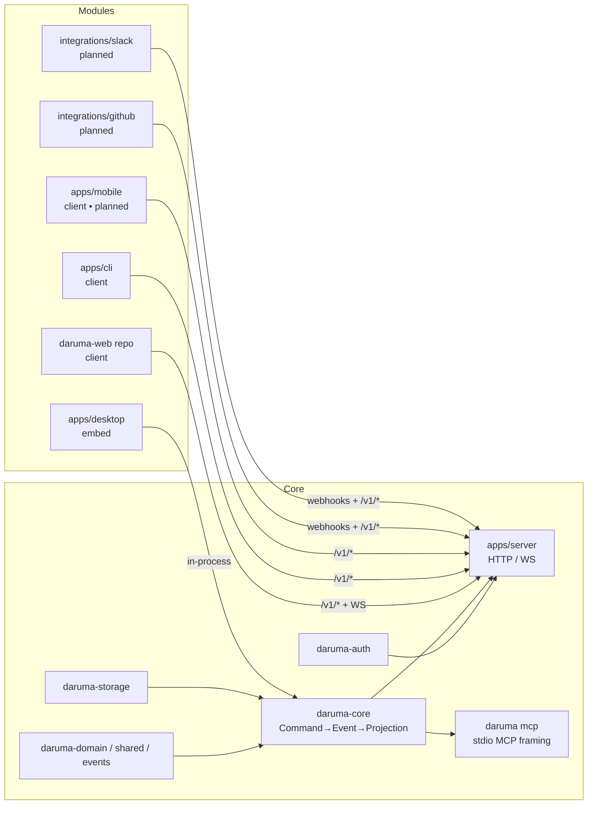

# Architecture

Daruma is an **AI-native, local-first** task runtime with a real-time
multi-agent surface. This document is the canonical contract every crate
and app must respect.

Policy decisions (backfill, cascade, sequence_id) — [architecture-policy.md](architecture-policy.md).
AI layer overview — [guides/ai-agent.md](guides/ai-agent.md).
Task/document version records — [VERSION_HISTORY.md](VERSION_HISTORY.md).

## Pipeline position (MeiSei)

Daruma is the **terminal execution layer** of the wider MeiSei maturity
pipeline (`torii → satori → enma → yatagarasu → fujin → daruma`): it
receives a mature Action Packet through the platform's handoff and turns
it into task/plan state — it does not emit work back upstream or to any
further pipeline hop. See
[ADR: terminal-execution-layer](adr/terminal-execution-layer.md) for the
decision and the code audit backing it: no `Command` primitive creates
work in another layer, the only handoffs in the `Command` enum are
agent↔agent within a work unit (not cross-layer), `ExternalRef` is
inbound correlation, and webhooks are observability push rather than a
way to create downstream work. `hyakki` is an out-of-band
clustering/observability tool, not a pipeline hop that consumes daruma's
output.

## Strict rules

1. **UI never mutates state.** UI emits commands.
2. **AI never writes to storage.** AI emits commands.
3. **Every mutation is an event.** Events are immutable, append-only.
4. **Projections are derived.** Repos materialize events into rows.
5. **Local-first.** All operations succeed without a network. Remote sync
   is opportunistic, not required.
6. **No business logic in UI.** UI views read projections and dispatch
   commands; that's it.
7. **No backdoors around the bus.** Every realtime fan-out (WS, agent
   inbox, webhooks, future MCP push) subscribes to the same
   `EventBus`/`EventStore` couple — nothing bypasses it.

## Layered design

```
┌──────────────────────────────────────────────────────────────────┐
│ apps/desktop (GPUI)  daruma-web↗  apps/server (Axum)  apps/cli │  UI / transports
├──────────────────────────────────────────────────────────────────┤
│ daruma-ai   daruma-sync   daruma-webhooks  daruma-mcp│  agent + realtime
├──────────────────────────────────────────────────────────────────┤
│ daruma-auth (bearer / capability / scope)                     │  authn / authz
├──────────────────────────────────────────────────────────────────┤
│ daruma-core    (commands → events → projections)              │  business logic
├──────────────────────────────────────────────────────────────────┤
│ daruma-storage (SQLite, event log, projections)               │  persistence
├──────────────────────────────────────────────────────────────────┤
│ daruma-events  daruma-domain  daruma-shared             │  pure types
└──────────────────────────────────────────────────────────────────┘
```

## Core and modules (§3.4)

Daruma draws an explicit line between **core** (the part with the
event log, the contract, the auth, the public REST/WS/MCP surface) and
**modules** (clients, embed binaries, future integrations). The split
is what lets independent teams ship without coordinating on every
release — see [docs/MODULES.md](docs/MODULES.md) for the live registry
and [docs/MODULE_CONTRACT.md](docs/MODULE_CONTRACT.md) for the formal
SLA.

### Core

The **core** is the set of crates and apps that own the contract:

- `crates/shared`, `crates/domain`, `crates/events` — pure types,
  no I/O.
- `crates/storage`, `crates/auth`, `crates/api-dto` — persistence,
  bearer tokens, public DTOs.
- `crates/core` — the `Command` / `CommandHandler` / `CommandBus`
  trio; the only place that turns commands into events.
- `apps/server` — Axum router on `/v1/*` (HTTP) + `/v1/ws`
  (WebSocket); the only network-facing surface.
- `apps/cli` (`daruma mcp`) — stdio MCP transport (re-exports the
  same command/event semantics over MCP framing via `crates/mcp`).
- `crates/sync`, `crates/webhooks`, `crates/ai`, `crates/mcp` —
  realtime fanout, outbound webhooks, AI tools, MCP wiring. Counted
  as core because they subscribe to the same `EventBus`/`EventStore`;
  no separate state of their own.

Core promises forward compatibility on `/v1/*`, the event schema, the
WS protocol, and the MCP tool catalogue. Breaking changes follow the
ritual in [docs/MODULE_CONTRACT.md](docs/MODULE_CONTRACT.md#versioning).

### Modules

Every other tree is a **module**, classified by *kind*:

- **transport** — a transport implementation that ships inside the
  workspace (today: `apps/server`, the `daruma mcp` stdio entry in
  `apps/cli`, `crates/sync`, `crates/webhooks`).
- **client** — `/v1/*` consumers with their own UI/CLI: `daruma-web`
  (standalone repo), `apps/cli`, planned `apps/mobile`.
- **embed** — runs the core in-process. `apps/desktop` (GPUI) is the
  shipped example; it does not open a port and goes through
  `crates/core/src/embed.rs` (W2.1) instead.
- **integration** — speaks to a third-party system. Planned:
  `integrations/github/`, `integrations/slack/`.

### Module → Core diagram



Read direction: arrows point at the contract the module depends on.
A module never reaches across to another module — only to core.

### Embed mode

`apps/desktop` runs the same `daruma-core` runtime in its own
process, with no network in the data path. The only public entry point
is `crates/core/src/embed.rs` (W2.1), which re-exports
`{Db, EventBus, CommandBus}` with identical semantics to the network
path. UI views subscribe to the in-process `EventBus`, dispatch
commands through `CommandBus::dispatch`, and never touch storage
directly — the same rule that applies to a remote client.

Embed clients don't carry a bearer token: they're trusted because they
run in the same address space as the core. Capability checks short-
circuit to `Admin`. WS, webhooks, and MCP transports are wired only on
the server binary, so an embed-only deployment is silent on the
network by design.

## Crate contracts

### `daruma-shared`
- `ids::{TaskId, ProjectId, EventId, AgentId, CommentId, ActivityId,
         TokenId, WebhookId, WebhookDeliveryId,
         PlanId, RunId, AgentSessionId, RelationId}`
  — UUIDv7 newtypes with stable display prefixes (`tsk_`, `prj_`, `act_`,
  `pln_`, `run_`, `ags_`, `rel_`, …).
- `time::Timestamp` — `chrono::DateTime<Utc>` alias; `time::now()`.
- `error::CoreError` — top-level domain error with `code() -> &'static str`
  returning the stable machine code (`not_found`, `validation`,
  `conflict`, `storage_error`, `sync_error`, `ai_unavailable`,
  `serialization_error`, `io_error`, `unauthorized`, `forbidden`).
- `Result<T, E = CoreError>`.

### `daruma-domain`
- `Task { id, project_id, title, description, status, priority,
          due_at, created_at, updated_at, started_at?, completed_at? }`
  — `started_at` is set lazily on the first non-terminal-to-InProgress
  transition; `completed_at` is set on `TaskClosed` and cleared on
  `TaskReopened`.
- `NewTask`, `TaskPatch`.
- `Project { id, title, description, created_at, updated_at }`.
- `Comment { id, task_id, author, body, parent_id?, created_at,
             edited_at?, deleted_at? }`, `NewComment`, `CommentPatch`.
- `Status: Inbox | Todo | InProgress | Done` — `is_terminal()` only `Done`.
- `Priority: P0 | P1 | P2 | P3`.
- `Actor: User | Agent { id, name }`.
- `AgentAction`, `AgentActionKind`.
- `Activity { id, task_id?, project_id?, actor, verb, field?, old_value?,
              new_value?, occurred_at, event_id, seq }` — immutable,
  append-only audit row; `seq` mirrors the source event's global sequence
  number and is the canonical pagination cursor.
- `Verb` — stable snake_case taxonomy:
  `created | updated | status_changed | priority_changed | closed |
  reopened | completed | deleted | split_generated |
  project_created | project_updated |
  commented | comment_edited | comment_deleted | agent_action |
  plan_created | plan_modified | plan_archived |
  run_started | run_completed | run_failed | run_aborted |
  task_attached | task_detached | task_claimed | task_released |
  linked | unlinked | unblocked`.
  `linked` / `unlinked` / `unblocked` are emitted by `TaskLinked`,
  `TaskUnlinked`, `TaskUnblocked` events respectively (§3.2).
  Pair-merging: semantic events (`TaskClosed`, `TaskReopened`,
  `TaskCommented`) update the preceding mechanical row's verb rather than
  inserting a new one; `event_id UNIQUE` guarantees idempotent backfill.

#### Plans, Runs & Agent Sessions (Section §3.1)

- `Plan { id, project_id, parent_plan_id?, title, description, goal,
         success_criteria, status, owner, created_at, updated_at,
         archived_at? }`, `NewPlan`, `PlanPatch`.
- `PlanStatus: Draft | Active | Completed | Abandoned`.
- `PlanTask { plan_id, task_id, position, depends_on }` — composite-PK
  junction; ordering by `position` is stable; the agent cursor is
  `task_id`, not `position`, so reorder doesn't break running steps.
- `PlanProgress { tasks_total, tasks_done, sub_plans_total,
                  sub_plans_done, completion_pct }` — derived; returned
  from `GET /v1/plans/{id}`.
- `Run { id, plan_id, agent_id, parent_run_id?, started_at, ended_at?,
        status, outcome? }`. `RunStatus: Active | Completed | Failed |
  Aborted`. `RunOutcome: Done | Superseded | HumanCompleted | Skipped |
  Failed { reason }`.
- `AgentSession { id, agent_id, parent_agent_id?, started_at, ended_at?,
                  plan_steps: Vec<AgentSessionPlanStep>, metadata }` —
  `plan_steps` is the Linear-style structured progress list (replaced
  atomically, not diffed). `AgentSessionPlanStep { content, status }`;
  `SessionStepStatus: Pending | InProgress | Completed | Canceled`.
- `SignalKind: Stop { reason? } | Elicit { prompt, choices } |
              AuthRequired { scope } | InterventionAccepted { choice }` —
  typed agent ⇄ human signals (Linear B.5).
- `ExternalRef { tenant, kind, external_id, internal_id, created_at }` —
  per-tenant idempotency key with composite PK
  `(tenant, kind, external_id)`.

### `daruma-events`
- `Event` enum — canonical schema; see `crates/events/src/event.rs`.
  Categories:
  - **Tasks** (mechanical): `TaskCreated`, `TaskUpdated`,
    `TaskStatusChanged`, `TaskPriorityChanged`, `TaskCompleted`,
    `TaskDeleted`, `TaskSplitGenerated`.
  - **Tasks** (semantic, emitted *alongside* mechanical ones):
    `TaskReopened`, `TaskClosed`, `TaskCommented`.
  - **Task relations** (§3.2): `TaskLinked { relation_id, from, to,
    kind, actor, occurred_at }`, `TaskUnlinked { relation_id, from, to,
    kind, occurred_at }`, `TaskUnblocked { task_id, unblocked_by,
    occurred_at }`. All three route to `Channel::Tasks`. `kind()` returns
    `"task.linked"`, `"task.unlinked"`, `"task.unblocked"`.
    `target_task()` returns `from` for Linked/Unlinked, `task_id` for
    Unblocked. `TaskUnblocked` is emitted in the same `append_batch` as
    the blocker's `TaskStatusChanged(to: Done)`.
  - **Projects**: `ProjectCreated`, `ProjectUpdated`.
  - **Comments**: `CommentAdded`, `CommentEdited`, `CommentDeleted`.
  - **Agents**: `AgentActionRecorded`.
  - **Plans** (mechanical): `PlanCreated`, `PlanUpdated`,
    `PlanStatusChanged`, `PlanGoalChanged`, `PlanTaskAdded`,
    `PlanTaskRemoved`, `PlanReordered`, `PlanArchived`.
  - **Runs** (mechanical): `RunStarted`, `RunStepStarted`,
    `RunStepFinished`, `RunCompleted`, `RunFailed`, `RunAborted`.
  - **Agent sessions / claims**: `AgentSessionStarted`,
    `AgentSessionEnded`, `AgentSessionPlanUpdated`, `AgentClaimed`,
    `AgentReleased`.
  - **Semantic** (emitted in the same `append_batch` as the mechanical
    sibling): `PlanModifiedByHuman { plan_id, during_run_id? }`,
    `TaskContested { task_id, actors, field? }`,
    `RunObsolescedByPlanEdit { run_id, plan_id, kind }` with
    `ObsolescenceKind: Archived | TaskRemoved | GoalChanged`.
  - **Run signals** (Linear B.5): `RunStopRequested`,
    `RunElicitationRequested`, `RunAuthRequired`,
    `RunInterventionAccepted`.
- Helpers: `kind() -> &'static str`, `target_task() -> Option<TaskId>`,
  `target_project() -> Option<ProjectId>` (synchronous — async resolution
  happens in the WS handler for events that only carry `task_id`), and
  `channel() -> Channel`.
- `Channel: Tasks | Comments | AgentStatus | Presence | Webhooks |
            Plans | Runs` — the filter currency used by `Subscribe`
  messages. `Plan*` events route to `Plans`; `Run*`, `Agent*`, semantic,
  and signal variants route to `Runs`.
- `EventEnvelope { id, seq, occurred_at, actor, payload }`.
- `EventStore` async trait: `append`, `append_batch`, `load_since`,
  `latest_seq`.
- `EventBus` — `tokio::sync::broadcast`-backed in-process bus.

### `daruma-storage`
- `Db::open(path)` / `Db::memory()` / `Db::migrate()`.
- Migrations in `crates/storage/migrations/`:
  - `0001_initial.sql` — events + tasks + projects.
  - `0002_comments.sql` — comments projection.
  - `0003_task_timestamps.sql` — `tasks.started_at` + `tasks.completed_at`.
  - `0004_tokens.sql` — `tokens` row + indexed `prefix`.
  - `0005_agent_acks.sql` — per-agent inbox cursor.
  - `0006_webhooks.sql` — webhook config + delivery log.
  - `0007_activity.sql` — `activity` projection (append-only audit rows;
    `event_id UNIQUE` for idempotent backfill; indexes on
    `(task_id, seq)`, `(project_id, seq)`, `seq`, and `verb`).
  - `0008_plans_runs_sessions.sql` — 7 tables: `plans`, `plan_tasks`,
    `runs`, `agent_sessions` (with `plan_steps_json`), `agent_claims`
    (TTL via `expires_at`), `external_refs` (composite PK), and the
    cross-cutting `processed_command_ids` (UUIDv4 → `(event_id, seq)`
    idempotency table; 7-day TTL via background sweep).
  - `0009_task_relations.sql` — `task_relations` table with
    `UNIQUE (from_task, to_task, kind)` + indexes on `(from_task, kind)`
    and `(to_task, kind)`. Enables §3.2 typed-relation storage.
- Repos: `SqliteEventStore`, `TaskRepo`, `ProjectRepo`, `CommentRepo`,
  `ActivityRepo`, `TokenRepo`, `AgentInboxRepo`, `WebhookRepo`,
  `PlanRepo`, `RunRepo`, `SessionRepo`, `AgentClaimRepo`,
  `ExternalRefRepo`, `IdempotencyRepo`, `RelationRepo`. Every repo with
  an `apply_event` is the canonical projection; reads must go through
  them. `RelationRepo` exposes `insert`, `get`, `delete`,
  `list_by_task`, `blockers_of`, `blocks_targets_of`.
- `ActivityRepo::list_for_task(task_id, cursor, limit, verbs?)` —
  cursor-paginated (exclusive `seq` lower bound); returns
  `(Vec<Activity>, next_cursor, has_more)`.
- `ActivityRepo::backfill_from_events(store)` — idempotent replay from
  any `seq` checkpoint; called once after `Db::migrate()` at startup.

#### Task Relations (Section §3.2)

- `RelationKind: Blocks | RelatesTo | Duplicates` — typed edge label.
  `Blocks` is direction-bearing and enforced: `from` blocks `to`.
  `RelatesTo` and `Duplicates` are stored with explicit direction but
  queried bidirectionally (union of both endpoints).
- `Relation { id: RelationId, from: TaskId, to: TaskId,
              kind: RelationKind, created_at: Timestamp,
              created_by: Actor }` — one row per directed edge.
  Cross-project relations are permitted; `target_project` for WS
  routing resolves from `from.project_id`.
- `TaskRelations { blocks, blocked_by, relates_to, duplicates,
                   duplicated_by: Vec<Relation> }` — derived read
  projection returned by `GET /v1/tasks/{id}/relations`.

**Hard blocking semantics.** `CommandHandler::build_events` for
`SetStatus { to: Done }` and `CompleteTask` first calls
`relation_enforcement::block_check`: if any `Blocks` relation has
`from.status != Done` the command fails with
`CoreError::conflict("task_blocked", ...)` (HTTP 409). When a blocker
transitions to Done, `TaskUnblocked { task_id, unblocked_by }` is
emitted atomically (same `append_batch`) for every downstream task
whose remaining blockers are all Done.

**DeleteTask cascade.** Before the `TaskDeleted` event, one
`TaskUnlinked` is emitted per affected relation, followed by
`TaskUnblocked` for any newly unblocked downstreams.

**Cycle detection.** `relation_enforcement::detect_cycle` runs on every
`LinkTasks { kind: Blocks }` command: iterative DFS from `to` searching
for `from`; cap `MAX_DEPTH = 1000`; fails with
`CoreError::validation("cycle_detected")` (HTTP 400). Cycle detection
is skipped for `RelatesTo` and `Duplicates`.

**Idempotency.** `LinkTasks` / `UnlinkTasks` honour `client_command_id`
via the shared `processed_command_ids` table (same §3.1 contract).
Storage also enforces `UNIQUE (from_task, to_task, kind)` as a second
guard.

#### Plan Tree (Section §3.1 extension)

- **Model:** `Plan.parent_plan_id?: PlanId` — nullable FK to parent plan.
  Root plans have `parent_plan_id = None`. No mandatory "root" singleton;
  any plan can be a root or a child.
- **Cycle invariant:** `detect_parent_cycle(plans, plan_id, candidate)`
  (in `daruma-core::plan_concurrency`) runs iterative DFS upward,
  capping at `MAX_PARENT_DEPTH = 3`. Rejects reparent with
  `CoreError::Validation("cycle_detected")` if candidate would create a cycle.
- **Progress aggregation:** `PlanProgress` already includes
  `sub_plans_total` and `sub_plans_done` (counted from the live `plans`
  table where `parent_plan_id = this.id`). Completion is transitive:
  a parent is `done` only if all tasks and all sub-plans are done.
- **Activity verb:** `PlanReparented` emitted when `UpdatePlan` carries
  a new `parent_plan_id` (whether reparenting to a new parent, to None,
  or staying the same). Recorded in `activity` projection with verb
  `"plan_modified"`.
- **MCP:** `daruma_plan_update { id, parent_plan_id: string | null | omit }`
  (from §3.3 W3 commit c72c67d). Null value unparents to root; omit leaves
  parent unchanged. Gated by `Capability::PlanWrite`.
- **WS broadcast:** `PlanUpdated` diff in `Channel::Plans` includes
  `parent_plan_id` field. Web treeview subscribes and reorders the
  hierarchy on each broadcast.
- **Web UI:** Treeview with chevron ▶/▼ for expand/collapse per plan node.
  CSS `--depth` custom property for indentation; max visual depth ~5 levels
  (no hard limit on the model; UI culls for UX).

### `daruma-core`
- `Command` enum (every mutation is a command):
  - `CreateTask`, `UpdateTask`, `CompleteTask`, `DeleteTask`,
    `SetStatus`, `SetPriority`, `SplitTask`, `RecordAgentAction`.
  - `CreateProject`, `UpdateProject`.
  - `AddComment`, `EditComment`, `DeleteComment`.
  - **Plans**: `CreatePlan`, `UpdatePlan`, `ArchivePlan`,
    `AddPlanTask`, `RemovePlanTask`, `ReorderPlan`, `SetPlanGoal`,
    `SetPlanStatus`.
  - **Runs**: `StartRun`, `RunStartStep`, `RunFinishStep`,
    `CompleteRun`, `FailRun`, `AbortRun`.
  - **Sessions**: `StartAgentSession`, `EndAgentSession`,
    `UpdateAgentSessionPlan` (Linear B.1, max 100 steps).
  - **Signals** (Linear B.5): `SendRunSignal`, `RespondRunSignal`.
  - **Claims**: `AcquireClaim`, `ReleaseClaim`.
  - **Relations** (§3.2): `LinkTasks { from, to, kind, client_command_id? }`,
    `UnlinkTasks { id, client_command_id? }`. Both gate on
    `Capability::TaskRelationWrite`. `LinkTasks` runs cycle DFS before
    emitting; `DeleteTask` cascades with `TaskUnlinked` per relation
    followed by `TaskUnblocked` for any newly unblocked downstreams.
- `CommandEnvelope { command, actor, client_command_id? }` — the
  optional `client_command_id: Uuid` (UUIDv4) is the universal
  idempotency key (see *Idempotency contract* below).
- `CommandHandler::build_events` emits semantic events alongside
  mechanical ones whenever a status transition crosses the terminal
  boundary, a comment is added, or a plan/run boundary is crossed:
  - `SetStatus(Done → non-Done)` → `TaskStatusChanged` + `TaskReopened`.
  - `SetStatus(non-Done → Done)` or `CompleteTask` →
    `TaskStatusChanged` + `TaskCompleted` + `TaskClosed`.
  - `AddComment` → `CommentAdded` + `TaskCommented{preview}` (80-char cap).
  - `RemovePlanTask(current_step)` → `PlanTaskRemoved` +
    `TaskContested` + `RunStepFinished{outcome: Superseded}` +
    `PlanModifiedByHuman` — all atomic in one `append_batch`.
  - `ArchivePlan(plan_with_active_run)` → `PlanArchived` +
    `RunAborted{reason: "plan_archived"}` +
    `RunObsolescedByPlanEdit{kind: Archived}` — atomic.
- `plan_concurrency::NextTaskResolver { plans, runs, tasks, claims }`
  with `next(plan_id, run_id, agent_id, claim_ttl?) -> Option<NextTask>`:
  picks the next non-Done task in `position` order whose `depends_on`
  are all Done; optionally acquires a TTL claim atomically. The
  resolver is stateless and re-queried at every step boundary —
  reorder/insert/remove are safe because the agent cursor is `task_id`,
  not `position`.
- `plan_concurrency::detect_parent_cycle(plans, plan_id, candidate)`:
  iterative DFS upward, `MAX_PARENT_DEPTH = 3`; rejects with
  `CoreError::Validation("cycle_detected")`.
- `relation_enforcement::detect_cycle(repo, from, to, kind)`:
  iterative DFS across `Blocks` edges, `MAX_DEPTH = 1000`; rejects with
  `CoreError::validation("cycle_detected")`. No-op for non-`Blocks`
  kinds. See §3.2 above.
- `relation_enforcement::block_check_and_unblock(state, task_id,
  done_events)`: checks active blockers before Done transition; appends
  `TaskUnblocked` events for newly unblocked downstreams.
- `CommandBus` — owns Arc'd handler; `dispatch(cmd, actor)`.

### `daruma-auth`
- `Capability` bit-flag enum (fine-grained + `Admin` wildcard) —
  the 6 W3-era bits are `PlanRead`, `PlanWrite`, `RunRead`, `RunWrite`,
  `SubscribePlans`, `SubscribeRuns`. §3.2 adds `TaskRelationRead`
  (1 << 20) and `TaskRelationWrite` (1 << 21). `TaskRelationRead` gates
  `GET /v1/tasks/{id}/relations`; `TaskRelationWrite` gates `POST
  /v1/relations` and `DELETE /v1/relations/{id}`. WS streaming of
  `TaskLinked/Unlinked/Unblocked` uses the existing `SubscribeTasks`
  gate via `Channel::Tasks` — no separate capability required.
- `Capabilities` u32 mask; `has()` honours `Admin`.
- `ProjectFilter::{All, Only{projects}}`.
- `TokenScope { projects, capabilities }`.
- `ApiToken { id, prefix, hash, kind, agent_id, scope,
              rate_limit_per_min, created_at, expired_at?,
              last_used_at?, revoked_at? }`.
  - `TokenKind: Pat | Bot | Svc`.
  - Plaintext rendered as `ta_<kind>_<24 b64-url chars>`; only the first
    12 chars (`prefix`) are stored alongside the argon2id hash of the
    full token.
- `TokenStore` async trait + `verify_bearer()` — looks up by prefix,
  argon2-verifies, classifies failures as
  `Missing | Malformed | Unknown | Mismatch | Revoked | Expired`.
- `AuthContext { agent_id, token_id, scope }`; handlers gate with
  `ctx.require(Capability::…)`.
### `daruma-webhooks`
- `Webhook { id, url, secret, events: Vec<String>, project_filter,
            is_active, created_at, updated_at }`.
- `sign_body_hex(secret, body)` — lowercase hex HMAC-SHA256 used by the
  `X-Daruma-Signature` header.
- `WebhookStore` async trait (CRUD + `record_delivery`).
- `spawn_dispatcher(receiver, store, http)` — subscribes to the bus,
  filters each envelope by `events_mask` + `project_filter`, then fans
  out a fire-and-forget POST. Each request carries:
  - `Content-Type: application/json`
  - `User-Agent: daruma/<version>`
  - `X-Daruma-Delivery: <uuid-v7>`
  - `X-Daruma-Event: <kind>`
  - `X-Daruma-Signature: hex(hmac_sha256(secret, body))`
  Delivery is single-shot for the MVP; retries-with-backoff are a
  follow-up.
- Webhook event kinds include (§3.2 additions): `task.linked`,
  `task.unlinked`, `task.unblocked`, plus `task.due` (due-date watchdog:
  an active task's `due_at` passed; emitted once per (task, due_at)
  value by a server tick, `DARUMA_DUE_TICK_SECS`, default 60, 0
  disables) — dispatched automatically via `Event::kind()` through the
  existing dispatcher; no new dispatcher code required.

### `daruma-mcp` (served via `daruma mcp` / `/v1/mcp`)
- 44 MCP tools — original 20 from B.5/W2.x plus 21 new in W3.2 covering
  the full plan/run/session/claim/signal surface, plus 3 new in §3.2
  for typed task relations:
  - **Tasks / projects / comments / agent / housekeeping** (19):
    `daruma_{create, get, list, project_list, project_create,
    project_use, workspace_info, set_status, set_priority, complete,
    delete, split, ai_decompose, comment, reopen,
    inbox_pull, subscribe_project, events_since, healthz}`.
  - **Plans** (9): `daruma_plan_{create, update, get, list,
    add_task, remove_task, reorder, next_task, archive}`.
  - **Runs** (5): `daruma_run_{start, start_step, finish_step,
    complete, abort}`.
  - **Sessions** (3, Linear B.1): `daruma_session_{start, end,
    set_plan}`.
  - **Signals** (2, Linear B.5): `daruma_signal_{send, respond}`.
  - **Claims** (2): `daruma_{claim, release}`.
  - **Relations** (3, §3.2): `daruma_link { from, to, kind,
    client_command_id? }`, `daruma_unlink { relation_id }`,
    `daruma_relations { task_id }` (returns 5 groups: blocks,
    blocked_by, relates_to, duplicates, duplicated_by).
- Dependency-light: hand-rolled JSON-RPC 2.0 over stdio (no `rmcp` SDK),
  with `initialize`, `tools/list`, `tools/call`, `ping`.
- Tool handlers funnel through `ApiClient` → bearer-authed HTTP to
  `daruma-server`. The binary reads `DARUMA_API_URL` (default
  `http://localhost:8080`) + `DARUMA_TOKEN` from env; logs go to
  stderr, stdout is reserved for JSON-RPC frames.
- Per-workspace default `project_id` is persisted under
  `~/.agents/daruma/workspaces.json` (override via
  `DARUMA_AGENT_DIR` / `DARUMA_WORKSPACES_FILE`). Legacy
  `~/.config/daruma/` and repo-local `daruma/workspaces.json` are
  migrated once — see [guides/mcp-client.md](guides/mcp-client.md).

### `daruma-sync`
- `Hub` — bridges `EventBus` to a WebSocket fanout; cheap to clone.
- `WsClientMessage` / `WsServerMessage` — JSON, tagged-union shape. v2
  extensions:
  - `Hello { server_seq, capabilities }` — first server frame. The
    capabilities Vec advertises `channels`, `resync`, `heartbeat`,
    `filters`, `plans`, `runs`, and `capability-gated-channels`.
  - `Subscribe { since_seq?, projects?, channels? }` — optional history
    catch-up + per-project + per-channel filters.
  - `Snapshot { since_seq, events, has_more, next_seq? }`.
  - `Resync { from_seq, dropped }` — on broadcast `Lagged`.
  - `Ping` / `Pong` — both directions; the server pings every 25 s.
  - `Ack { event_id }` (scaffold).
- **Per-event capability gate** (W3.3): before forwarding each envelope,
  the WS loop resolves the channel via `payload.channel()` and silently
  drops envelopes whose channel-required capability is absent from the
  subscriber's token. `Tasks → SubscribeTasks`, `Comments →
  SubscribeComments`, `AgentStatus → SubscribeAgentStatus`, `Plans →
  SubscribePlans`, `Runs → SubscribeRuns`. Subscriber sees a clean
  feed of channels they're allowed to see — no info-leak across scopes.
  §3.2 relation events (`TaskLinked`, `TaskUnlinked`, `TaskUnblocked`)
  route to `Channel::Tasks` and are therefore gated by `SubscribeTasks`
  — not by `TaskRelationRead`, which only gates the REST GET endpoint.

### `daruma-ai`
- `OpenAiClient` wraps the OpenAI Responses API. Returns `Command`
  values only — never touches storage.

### `apps/server` (Axum)

**URL layout**

| Prefix   | Paths                                                       | Auth | Notes |
|----------|-------------------------------------------------------------|------|-------|
| (root)   | `GET /healthz`                                              | —    | Health check; no versioning. |
| `/v1`    | `GET /healthz`, `GET /ws`                                   | —    | Public surface. WS bearer auth via `Sec-WebSocket-Protocol`; `?token=…` is legacy fallback. |
| `/v1`    | `GET /tasks`, `GET /tasks/{id}`, `GET /projects`,           | ✔    | Bearer middleware + per-handler `require(Capability)`. |
|          | `POST /commands`, `GET /events?since&limit`,                |      |  Each command kind maps to a `task:write`/`comment:write`/etc gate. |
|          | `POST /ai/parse`, `POST /ai/decompose/{task_id}`,           |      | `agent:dispatch`. |
|          | `GET  /tasks/{task_id}/activity?cursor&limit&verbs`,        |      | `task:read`. Cursor-paginated audit log. Deleted-task fallback via audit rows. |
|          | `POST /tasks/{task_id}/comments`,                           |      | `comment:write`. |
|          | `GET  /tasks/{task_id}/comments`,                           |      | `comment:read`. |
|          | `PATCH /comments/{id}`, `DELETE /comments/{id}`,            |      | `comment:write`. |
|          | `POST /tokens`, `GET /tokens`, `DELETE /tokens/{id}`,       |      | `token:write` / `token:read`. |
|          | `GET /agents/{id}/inbox`, `POST /agents/{id}/inbox/ack`,    |      | `agent_id == ctx.agent_id` or `Admin`. |
|          | `POST /webhooks`, `GET /webhooks`,                          |      | `webhook:write` / `webhook:read`. |
|          | `PATCH /webhooks/{id}`, `DELETE /webhooks/{id}`             |      | `webhook:write`. |
|          | `POST /plans`, `PATCH /plans/{id}`, `GET /plans/{id}`,      |      | `plan:write` / `plan:read`. `GET` returns `Plan + PlanProgress`. |
|          | `GET /plans?project_id=&status=`,                           |      | `plan:read`. List with optional status filter. |
|          | `POST /plans/{id}/tasks`,                                   |      | `plan:write`. AddPlanTask. |
|          | `DELETE /plans/{id}/tasks/{task_id}`,                       |      | `plan:write`. RemovePlanTask. |
|          | `POST /plans/{id}/reorder`, `POST /plans/{id}/archive`,     |      | `plan:write`. |
|          | `GET /plans/{id}/next-task?run_id=&claim_ttl_secs=`,        |      | `run:write`. NextTaskResolver entry. |
|          | `GET /plans/{id}/progress`,                                  |      | `plan:read`. Status counts + `next_ready`. |
|          | `POST /runs`, `POST /runs/{id}/step/start`,                 |      | `run:write`. |
|          | `POST /runs/{id}/step/finish`,                              |      | `run:write`. |
|          | `POST /runs/{id}/complete`, `POST /runs/{id}/abort`,        |      | `run:write`. |
|          | `POST /runs/{id}/signal`, `POST /runs/{id}/signal/respond`, |      | `run:write`. Linear B.5 typed signals. |
|          | `POST /sessions`, `POST /sessions/{id}/end`,                |      | `agent:dispatch`. |
|          | `PATCH /sessions/{id}/plan-steps`,                          |      | `agent:dispatch`. Linear B.1 plan replace. |
|          | `POST /claims`, `DELETE /claims/{agent_id}/{task_id}`       |      | `run:write`. TTL claim acquire/release. |
|          | `POST /relations`,                                          |      | `TaskRelationWrite`. Create typed relation; emits `TaskLinked`. |
|          | `DELETE /relations/{relation_id}`,                          |      | `TaskRelationWrite`. Delete relation; emits `TaskUnlinked`. |
|          | `GET /tasks/{task_id}/relations`                            |      | `TaskRelationRead`. Returns 5-group `TaskRelations` shape. |
| (legacy) | every authed path **without** `/v1`                         | ✔    | Sunset aliases — emit `Deprecation: true` and `Sunset: <startup+30d>`. |

**Cross-cutting middleware**
- `request_id`: every request gets `X-Request-Id: req_<uuidv7>` (echoes
  client-provided value if present); injected into request extensions.
- `require_auth` (`apps/server/src/middleware/auth.rs`): parses
  `Authorization: Bearer …`, calls `verify_bearer`, inserts
  `AuthContext` into request extensions, returns structured 401 on
  failure.
- Structured errors: `{"error": {"code", "message", "field"?, "request_id"?}}`
  with `Unauthorized → 401`, `Forbidden → 403`.

**Bootstrap**
- On the first run (no active tokens) the server generates a long-lived
  `svc` admin token, persists it, writes the plaintext to
  `<data_dir>/bootstrap.token` (mode 0600 on Unix), and prints it once
  to stderr. Subsequent runs skip.

**Webhook dispatcher** is spawned at startup against `bus.subscribe()`.

**Background sweeps** (W3.1):
- Claim TTL sweep — every 30 s: `claims.sweep_expired()` returns the
  released `(agent_id, task_id)` pairs and the server dispatches a
  `Command::ReleaseClaim` per pair so an `AgentReleased` event flows
  through projections + WS.
- Idempotency cleanup — every hour: `idempotency.cleanup_older_than(7d)`.

## Idempotency contract (W3.1, ROADMAP §4.5)

Every mutation can carry an optional client-generated
`client_command_id: Uuid` (UUIDv4) in the `CommandEnvelope`.

`apps/server/src/routes.rs::dispatch_command` honours it:

1. If present, `idempotency.lookup(ccid)` → on hit, return the cached
   `MutationResponse { event_id, event_seq }` without calling the
   handler. The event log is **not** appended again.
2. On miss, run the handler normally; after `append_batch` succeeds,
   `idempotency.insert(ccid, last.id, last.seq)` so retries collapse.

`processed_command_ids` (migration 0008) is the canonical store:
`(client_command_id PK, server_event_id, server_event_seq,
  created_at)`. TTL = 7 days, swept hourly. Reserved for plan/run/
session command idempotency now, applies to every Create-mutation
going forward.

## Mutation response shape (W3.1, ROADMAP §4.6)

Every successful mutation response — `POST /v1/commands` plus the
direct REST endpoints (`POST /v1/plans`, `POST /v1/runs`, …) — returns:

```json
{
  "success": true,
  "event_id": "evt_01HXY...",
  "event_seq": 4217,
  "data": { /* entity-specific payload */ },
  "client_command_id": "<uuid or omitted>"
}
```

- `event_id` / `event_seq` are the canonical anchor of the **last**
  emitted event for the command. Clients use `event_seq` as a watermark
  for optimistic UI and conflict detection.
- For no-op commands (e.g. `SetStatus` with an unchanged status),
  `event_id` and `event_seq` are absent; `success` is still `true` and
  `data` carries the unchanged entity.
- On error, the response is `{"error": {"code", "message", "field"?,
  "request_id"?}}` instead — no `event_id`/`event_seq`.

### `apps/desktop` (GPUI)
- Embeds `Db` + `EventBus` + `CommandBus` in-process; no HTTP needed.
- Dark theme, keyboard-first; AI calls produce commands.

### `daruma-web` (Leptos CSR client — standalone repo)

Extracted from this monorepo into the sibling **`daruma-web`** repo so the
OSS server stays a bare API + MCP backend. It consumes the OSS crates read-only
via a `vendor/oss` symlink (Cargo path deps), matching the documented local
development override pattern.

- **Stack:** Leptos 0.7 CSR (client-side rendering, no SSR/hydration),
  compiled to WASM via Trunk. HTTP calls via `gloo-net`, WebSocket
  subscription via `gloo-net::websocket`. Bearer auth passed through
  `Sec-WebSocket-Protocol: daruma.v1, bearer.<token>` on the WS handshake.
- **Dependencies:** `daruma-domain` (task/project/plan types shared
  with the server — no manual `types.ts`), `daruma-shared` (IDs,
  Timestamp), `daruma-events` with `default-features = false` (no
  Tokio runtime; only pure types for deserialising `WsServerMessage`),
  `daruma-api-dto` — all via `vendor/oss/crates/*`.
- **Wire mirrors:** `CommandEnvelope`, `MutationResponse`,
  `WsServerMessage`, `WsClientMessage` are re-declared locally in
  `src/api.rs` to avoid pulling Axum/Tokio into the WASM build.
- **Serving:** the server no longer bundles the UI. Deploy the Trunk
  `dist/` bundle behind any static host (or the remote `/app/` mount) and
  point it at the server's `/v1/*` + `/v1/ws`. `trunk serve` proxies
  `/v1/*` to `127.0.0.1:8080` for local dev.
- **Build:** `cd ../daruma-web && sh scripts/link-oss.sh && trunk build
  --release` produces `dist/`.

## End-to-end flow

```
User keystroke / AI tool call / MCP tool/call
        ↓
   Command
        ↓
 CommandBus.dispatch                ← capability check at the HTTP edge
        ↓
 CommandHandler.validate → emit Event(s) including any semantic siblings
        ↓
 EventStore.append_batch            ← seq assignment, ACID
        ↓
 Repo.apply_event(s)                ← projections (tasks, projects, comments, activity)
        ↓
 EventBus.publish                   ← in-process fanout
        ↓
 Subscribers:
   - WS Hub (per-project / per-channel filter, snapshot+live race fix, Resync on Lagged)
   - Agent inbox (cursor-based pull + long-poll)
   - Webhook dispatcher (HMAC-signed POST per match)
   - Desktop UI views (in-process)
```

## Schemas

`crates/events/src/event.rs` is the **canonical** schema. The wire
formats (`crates/sync/src/wire.rs`, AI tools in `crates/ai/src/tools.rs`,
and webhook bodies) all mirror it. If they diverge, events win.

## Notes for implementers

- All async traits use `async-trait`.
- All public types derive `Clone`, `Debug`, `Serialize`, `Deserialize`
  unless there's a reason not to.
- Errors propagate as `daruma_shared::CoreError`.
- Keep files under ~300 lines (split modules as needed).
- No business logic in views or HTTP handlers — everything goes through
  `CommandBus`.
- Tests live next to the module they cover (`#[cfg(test)] mod tests`)
  for unit tests; integration tests for `apps/server` go in
  `apps/server/tests/` and exercise the real `router(state)`.
